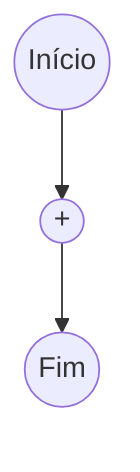
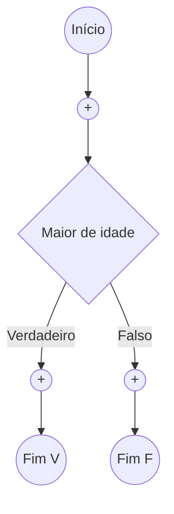
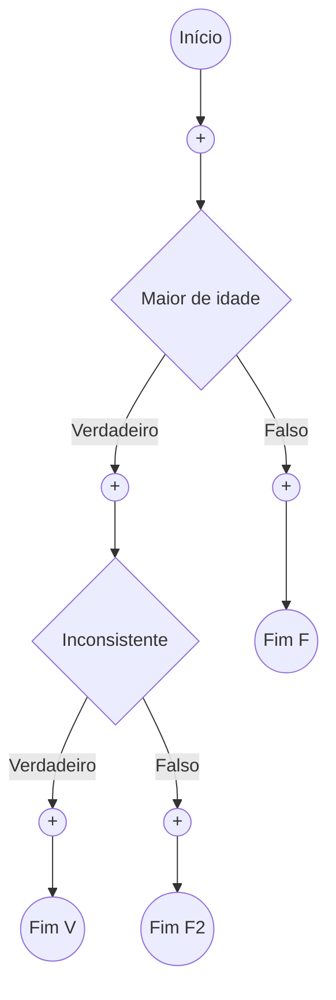
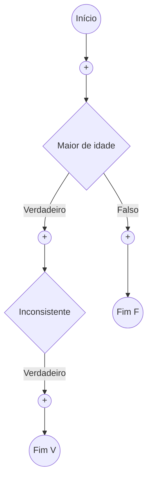
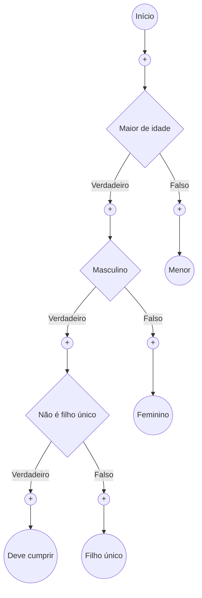

# Introdução ao Rulify 🔥

Olá, _tester_! Obrigado por aceitar testar esse projeto! Essa é uma pequena documentação / guia do Rulify.

**LEMBRE-SE: O seu objetivo não é criar fluxos perfeitos — na verdade, é o contrário. Você deve criar fluxos logicamente incorretos, redundantes, conflitantes e incompletos. Depois, é só clicar em** `✨Testar` **para verificar os erros! Em seguida, você pode corrigi-los, testar novamente e, por fim, clicar em** `Executar`

## Tipos de dados 🧾

| NOME     | DESCRIÇÃO                                   |
| -------- | ------------------------------------------- |
| `number` | representa dados numéricos (é um _float_)   |
| `bool`   | booleano, podendo assumir `true` ou `false` |
| `text`   | representa dados textuais (é uma _string_)  |

## Operadores 📑

| Operador             | Aplicável a                              | Resultado                         |
| -------------------- | ---------------------------------------- | --------------------------------- |
| `+`                  | `number` → soma<br>`text` → concatenação | `1+2=3`, `'a'+'b'='ab'`           |
| `-`                  | `number`                                 | `5-3=2`                           |
| `*`                  | `number`                                 | `2*3=6`                           |
| `/`                  | `number`                                 | `6/3=2`                           |
| `=`, `!=`            | todos                                    | Igualdade/Desigualdade estrutural |
| `<`, `<=`, `>`, `>=` | `number`                                 | Comparação                        |
| `and`, `or`          | todos                                    | Lógica proposicional              |
| `not`                | `bool`                                   | Negação                           |

## Funções de texto 📜

| Nome da função | O que faz                                   | Exemplo                 |
| -------------- | ------------------------------------------- | ----------------------- |
| `length`       | Retorna o comprimento do texto.             | `length(name)`          |
| `contains`     | Verifica se `item` está em `container`.     | `contains(name, 'vi')`, |
| `startsWith`   | Verifica se o texto começa com o `prefix`.  | `startsWith(name, 'A')` |
| `endsWith`     | Verifica se o texto termina com o `suffix`. | `endsWith(name, 'S')`   |

> Note que o segundo argumento das funções deve ser passado por aspas simples ('), e não por aspas duplas ("), independente do comprimento do argumento.

## Exemplo! 🛠️

Vamos criar um exemplo simples para concretizar as ideias apresentadas até agora. Este fluxo tem por objetivo **verificar se uma pessoa deve ou não se alistar no serviço militar obrigatório**.

### Criar nó inicial e variáveis

Crie um novo fluxo, nomeie-o como "Serviço Militar Obrigatório" (e escreve uma descrição se você quiser). <br>
Ao entrar no editor, crie um nó `Início` e adicione as seguintes variáveis.

| Nome        | Tipo     | Variável Obrigatória |
| ----------- | -------- | -------------------- |
| idade       | `number` | Não                  |
| sexo        | `text`   | Não                  |
| filho_unico | `bool`   | Não                  |

Ao fim dessa etapa, o seu fluxo deve estar assim:



---

### Criar a primeira condição

Clique no botão `+` logo abaixo do nó inicial, selecione o tipo `Condicional`. Dê o nome de `Maior de idade` ao nó e cole a seguinte expressão:

```
idade >= 18
```

Depois, clique em `Criar nó` para adicioná-lo ao fluxo de decisão (_e aproveite para renomear os nós `Fim` para evitar confusão_):



---

### Adicionar erro lógico

Nossa lógica está muito boa até agora, isso não é bom...<br>
Vamos adicionar um pouco de inconsistência nesse fluxo!<br>
Para isso, crie um novo nó condicional no ramo verdadeiro do nó `Maior de idade`. Dê a ele um nome qualquer, como `Inconsistente`, e cole:

```
idade < 18
```

Veja que essa expressão contradiz a expressão anterior: se `idade >= 18`, logo `idade < 18` é impossível. Vamos manter dessa forma para ver o que a função `✨Testar` retorna.



**Agora, salve e clique em** `✨Testar`**! Qual foi o resultado?**

> Você provavelmente viu que o nó `Fim V` é inalcançável. Isso acontece porque a condição `idade >= 18 and idade < 18` é impossível de ser satisfeita.<br>
> Embora esse caso seja trivial, identificar inconsistências em expressões mais complexas pode ser bem trabalhoso. Experimente criar suas próprias expressões!

---

### Adicionar redundância

Vamos mudar a expressão do nó `Inconsistente` para a seguinte:

```
idade >= 18 and (startsWith(sexo, 'M') or startsWith(sexo, 'm'))
```

Parece que está tudo ok agora, né? Vamos verificar salvando e testando o fluxo novamente!

> Agoram todos os nós `Fim` foram alcançados e possuem um caso real (ícone ✅ no canto superior esquerdo do nó). Contudo, o nó `Inconsistente` apresenta um _`⚠️warning`_. Ao clicar no ícone você verá a mensagem:
>
> ```
> A expressão "idade >= 18 and (startsWith(sexo, 'M') or startsWith(sexo, 'm')"
> pode ser simplificada apenas por "(startsWith(sexo, 'M') or startsWith(sexo, 'm')".
> Partes sugeridas para remoção: "idade >= 18"
> ```
>
> Mesmo que a expressão seja válida, há otimizações que podem ser feitas! A simplificação da expressão melhora a coesão do fluxo.

---

### Quebrar o fluxo

Vamos acatar a sugestão anterior e simplificar a expressão do nó `Inconsistente`:

```
startsWith(sexo, 'M') or startsWith(sexo, 'm')
```

Agora, vamos quebrar o fluxo, removendo o nó `Fim F2`. Para isso, clique nele com o botão esquerdo do mouse e selecione `🗑️Excluir`. Seu fluxo ficará assim:



**Salve e testar novamente!**

> O _`⚠️warning`_ do nó `Inconsistente` agora indica:
>
> ```
> Este nó possui ramificações sem conclusão.
> Restrições não cobertas: "idade >= 18", "not (startsWith(sexo, 'M') or startsWith(sexo, 'm'))"
> ```
>
> Ou seja, não há tratativa para quando a variável `idade` for maior ou igual a 18 e a variável `sexo` não começar com "M" ou "m".

---

### Corrigir fluxo

Finalmente, vamos corrigir e completar o fluxo.

- readicione o nó `Fim` faltante;
- renomeie o nó `Inconsistente` para `Masculino`
- crie um novo nó condicional no ramo verdadeiro do nó `Masculino`. Nomeie-o como `Não é filho único` e cole a seguinte expressão:

```
not filho_unico
```

Seu fluxo vai ficar assim:



Você pode customizar as respostas de cada nó `Fim`:

> nó `Menor`
>
> ```json
> { "deve_cumprir": false, "razão": "é menor de idade" }
> ```

> nó `Feminino`
>
> ```json
> { "deve_cumprir": false, "razão": "o sexo é feminino" }
> ```

> nó `Filho único`
>
> ```json
> { "deve_cumprir": false, "razão": "é filho único" }
> ```

> nó `Deve cumprir`
>
> ```json
> { "deve_cumprir": true, "razão": "cumpre todos os requisitos" }
> ```

**Pronto! Agora você pode salvar e testar mais uma vez para garantir que está tudo certo.**<br>
Com o fluxo completamente correto, você pode clicar em `Executar`, podendo copiar os casos concretos gerados no `✨Testar`.

## Conclusão

Agora é sua vez! Crie seus próprios fluxos, introduza erros de propósito e depois corrija-os.<br>

Mais uma vez, obrigado por testar o **Rulify!**
